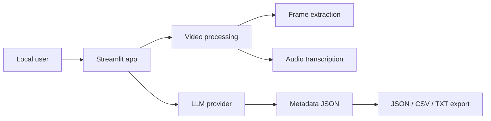

# VidMeta AI

Analyze local videos with AI and generate upload-ready metadata for YouTube, Instagram, Facebook, TikTok, and LinkedIn.

VidMeta AI is a Python Streamlit local app. It is not a React/Vite frontend or Node/Express backend. Users run it on their own machine, choose a local video or folder, and generate titles, descriptions, hashtags, keywords, CTAs, and posting tips.

## Features

- Single video analysis by upload or local file path.
- Batch processing for a local folder of videos.
- Frame extraction with OpenCV.
- Optional audio transcription with `ffmpeg` and Whisper.
- LLM providers: Ollama, OpenRouter, OpenAI, Anthropic, and Google Gemini.
- Exports: JSON, CSV, TXT.
- Large browser upload limit configured to 2048 MB by default.
- Local file path mode for videos larger than the browser upload path should handle.

## Prerequisites

| Tool | Required | Notes |
| --- | --- | --- |
| Python 3.10+ | Yes | Python 3.11 recommended |
| ffmpeg | Yes for audio | Frame-only analysis works without transcription |
| Ollama | Optional | For local/private LLM inference |

Install ffmpeg:

```bash
# macOS
brew install ffmpeg

# Ubuntu/Debian
sudo apt install ffmpeg
```

## Setup

```bash
git clone <your-repo-url>
cd VidMeta-AI

python -m venv .venv
source .venv/bin/activate

pip install -r requirements.txt
pip install .

vidmeta run
```

Open `http://localhost:8501`.

## Large Video Uploads

Streamlit limits browser uploads to 200 MB by default. This repo fixes that in two places:

- `.streamlit/config.toml` sets `maxUploadSize = 2048` and `maxMessageSize = 2048`.
- `vidmeta run` passes the same values as Streamlit CLI flags.

To change the limit:

```bash
VIDMETA_MAX_UPLOAD_MB=4096 VIDMETA_MAX_MESSAGE_MB=4096 vidmeta run
```

For very large videos, use `Local file path` or `Batch - Folder`. That keeps processing local and avoids pushing the entire video through the browser upload channel.

## LLM Provider Setup

### Ollama - local/private

```bash
ollama pull moondream
ollama pull gemma4
```

In the sidebar, choose `Ollama - Local / Free`, set the URL to `http://localhost:11434`, and enter the model name.

### Hosted providers

The sidebar supports OpenRouter, OpenAI, Anthropic, and Gemini keys. For local use, entering keys in the sidebar is convenient. For hosted deployments, use server-side environment variables and do not persist provider keys in browser cookies.

## Docker

```bash
docker compose up --build
```

Open `http://localhost:8501`.

Put videos in `./videos` and use paths like `/videos/example.mp4` inside the app.

If Ollama runs on your host machine, use `http://host.docker.internal:11434` from inside Docker.

## Documentation

- [Deep folder audit](docs/FOLDER_AUDIT.md)
- [API and CLI contract](docs/API_CONTRACT.md)
- [Environment variables](docs/ENVIRONMENT.md)
- [Dependency/security audit](docs/DEPENDENCY_SECURITY_AUDIT.md)
- [Architecture](docs/ARCHITECTURE.md)
- [Database schema](docs/DATABASE_SCHEMA.md)
- [SQLite schema SQL](docs/schema.sql)
- [Deployment guide](docs/DEPLOYMENT.md)
- [Roadmap](docs/ROADMAP.md)
- [Issue backlog](docs/ISSUE_BACKLOG.md)
- [Production checklist](docs/PRODUCTION_CHECKLIST.md)
- [SEO optimization audit](docs/SEO_OPTIMIZATION_AUDIT.md)
- [AI prompt optimization](docs/AI_PROMPT_OPTIMIZATION.md)
- [Refactor plan](docs/REFACTOR_PLAN.md)
- [SaaS blueprint](docs/SAAS_BLUEPRINT.md)

## Correct Architecture Summary



## Troubleshooting

### Upload still says 200 MB

Run the app with:

```bash
vidmeta run
```

or from the repository root:

```bash
streamlit run app.py --server.maxUploadSize 2048 --server.maxMessageSize 2048
```

Restart Streamlit after changing upload limits.

### `cv2` import error

```bash
pip install opencv-python-headless
```

### `ffmpeg` not found

Install ffmpeg and confirm:

```bash
ffmpeg -version
```

### Ollama connection refused

Start Ollama:

```bash
ollama serve
```

### LLM returns invalid JSON

Try a stronger model or reduce transcript/frame volume. JSON validation and repair are listed in the refactor plan.

## License

MIT. See [LICENSE](LICENSE).
