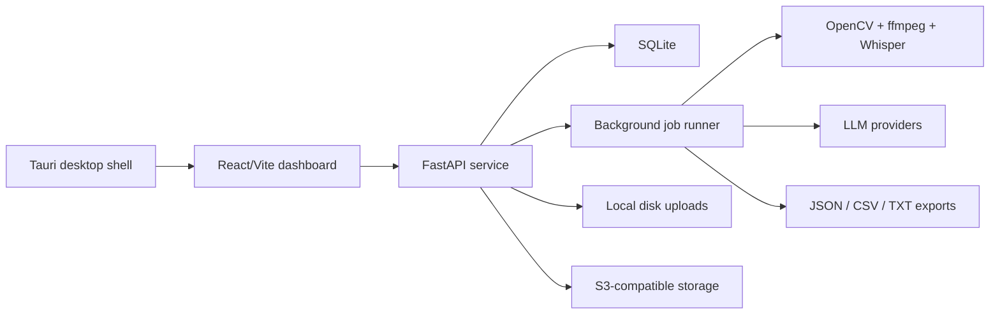

# Architecture

## Current Architecture

## Main Modes

- **Local web:** run `vidmeta serve` and `web`.
- **Desktop:** run the Tauri shell for native file/folder pickers.
- **Private hosted:** run the API and dashboard on a trusted network.

## Large File Strategy

The preferred large-video flow is local-path processing through the FastAPI service. Browser uploads use resumable chunks. Hosted uploads can be stored on local disk or S3-compatible storage.

## Legacy

The old Streamlit app lives in `legacy/app_streamlit.py` only as a migration reference.
