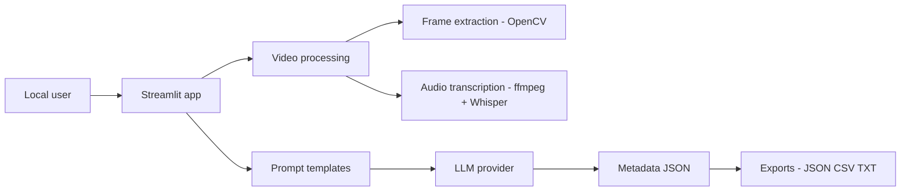
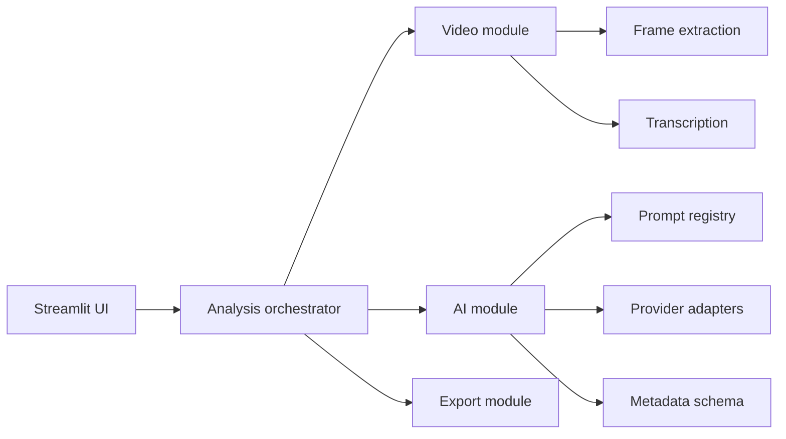
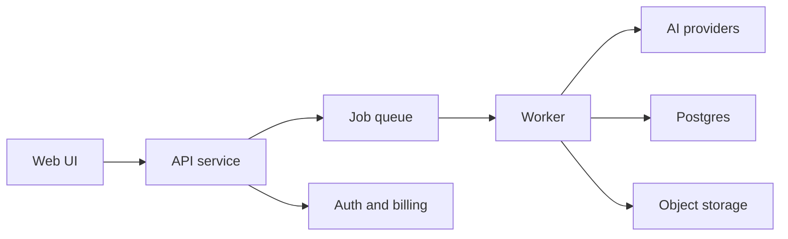

# Enterprise Architecture

## Correct current architecture

## Local-first principles

- Videos remain on the user's machine when using local file path or batch folder mode.
- Browser upload mode copies the selected file to a temporary local file and deletes it after processing.
- Ollama can keep inference local. Hosted LLM providers receive extracted frames and prompts.

## Target modular architecture

## Hosted/SaaS architecture option

Only use this if the project changes from local MIT app to hosted SaaS:

For the stated GitHub MIT local goal, the hosted architecture is a future blueprint, not required now.
