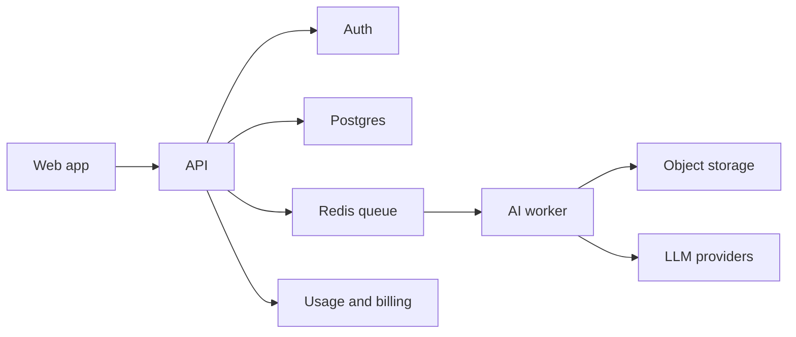

# Scalable SaaS Blueprint

The current project should ship as a local MIT app first. This blueprint is for a future hosted product.

## Core services

## Required SaaS features

- User accounts and workspaces.
- Project history.
- Credit/token accounting.
- Billing and invoices.
- Upload storage and retention controls.
- Queue-backed processing.
- Admin observability.

## Suggested stack

- Web: current React/Vite dashboard; Next.js can be considered if public SaaS routing/auth needs grow.
- API: FastAPI.
- Worker: Python worker process.
- Queue: Redis + RQ/Celery/Arq.
- Database: Postgres.
- Storage: S3-compatible object storage.
- Auth/billing: managed provider first.

## Do not add immediately

- Multi-tenant billing.
- Vector search.
- Complex RAG.
- Microservices.

Those are not needed for the MIT local release.
